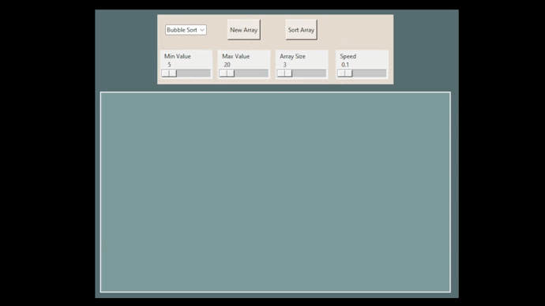
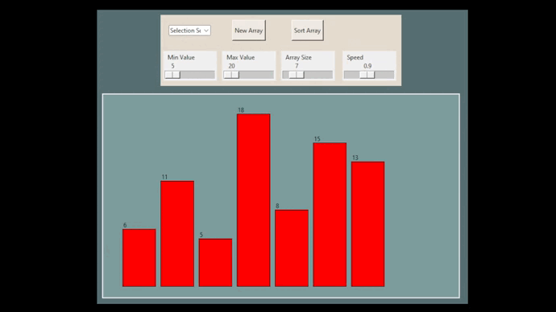

# AlgorithmsVisualizer

This is a desktop application made with python and tkinter.

Launch app
```
python main.py
```
Algorithms:
- Bubble Sort
- Selection Sort
- Insertion Sort
- Merge Sort
- Heapsort
- Quicksort

Heap Sort:
<p></p>
Selection Sort:
<p></p>
